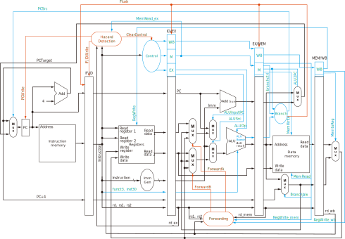

# Riscpu

Riscpu 是一个五级流水 RISC-V 处理器的 RTL 实现，支持 RV32I 中的部分指令，目前支持的指令如下：

| Type   | Instructions                                                 |
| ------ | ------------------------------------------------------------ |
| R-type | add, sub, sll, slt, sltu, xor, srl, sra, or, and             |
| I-type | jalr, lw, addi, slti, sltiu, xori, ori, andi, slli, srli, srai |
| S-type | sw                                                           |
| B-type | beq, bne, blt, bge, bltu, bgeu                               |
| U-type | lui, auipc                                                   |
| J-type | jal                                                          |

代码保存在 `pipeline` 目录下。`data_mem.v` 和 `inst_mem.v` 中分别构建了一个数据存储和指令存储，其中包含不可综合语法，仅供测试使用。处理器的其余部分均可以综合。`single` 目录下还提供了一个未进行流水的单周期设计。

设计参考了 \[1\] 中的讲解，做了部分修改。实际使用的处理器结构如下图所示：



## Example

使用下面的汇编代码：

```assembly
addi x1, x0, -10
add x2, x1, x1
sub x3, x1, x2
and x4, x2, x0
or x5, x2, x1
sw x5, 0(x0)
sw x1, 4(x0)
beq x1, x0, L1
add x5, x2, x0
L1:
bne x2, x5, error1
bne x2, x4, L2
error1: 
add x3, x0, x0
L2:
lw x8, 0(x0)
lw x9, 4(x0)
addi x9, x9, 8
beq x8, x9, L3
error2:
add x3, x0, x0
L3:
add x3, x3, x3
```

汇编后得到机器码

```text
ff600093
00108133
402081b3
00017233
001162b3
00502023
00102223
00008463
000102b3
00511463
00411463
000001b3
00002403
00402483
00848493
00940463
000001b3
003181b3
```

将上述机器码保存在 `pipeline/machinecode.txt` 中。`pipeline/data_mem.txt` 中保存了数据存储器的初始值，如有需要也可以修改。

> [!WARNING]  
> 在本项目中并没有直接指定代码段从 0x200 开始，而是从 0 开始。若使用了 auipc、jalr 等直接修改 PC 值的指令，由于许多汇编器会认为代码段的开始位置是 0x200，使用这些汇编器得到的机器码运行的结果可能与预期不同。

项目提供了可用于 ModelSim 的 `do` 脚本进行快速仿真测试。首先在项目目录启动 ModelSim

```shell
cd <path to project>/pipeline
modelsim
```

此后在 ModelSim 的命令窗口中，运行编译脚本和仿真脚本

```modelsim
ModelSim> do build.do
ModelSim> do sim.do
```

即可快速进行一轮仿真。仿真时默认添加了选项 `+define+DEBUG` （在 `build.do` 中），定义 `DEBUG` 会在仿真时额外打印部分调试信息，包括何时向寄存器写入数值、PC 的跳转等，在仿真结束后也会打印出寄存器中的内容，并生成一个 `data_mem_dump.txt` 文件，保存运行结束时 Data Memory 的内容。

## Thanks

[QtRvSim](https://github.com/cvut/qtrvsim)

[spu32](https://github.com/maikmerten/spu32)

## References

\[1\] David A Patterson, John L Hennessy. Computer organization and design: the hardware/software interface, risc-v edition. Morgan Kaufmann, 2018.
